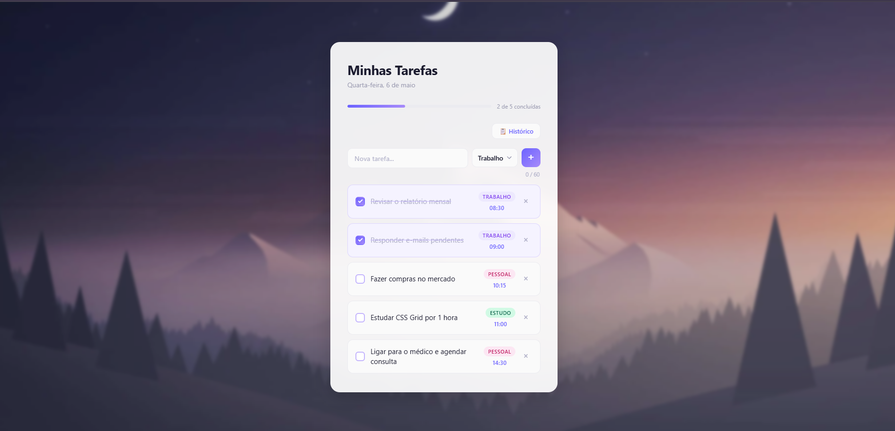

# 📝 Todo List

Uma aplicação de lista de tarefas elegante, responsiva e totalmente client-side, construída com HTML, CSS e JavaScript puro — sem frameworks, sem dependências externas.



---

## ✨ Funcionalidades

### Gerenciamento de Tarefas
- **Adicionar tarefas** com texto livre e categoria
- **Marcar como concluída** via checkbox customizado
- **Excluir tarefas** individualmente com o botão `×`
- **Validação de entrada** em tempo real — rejeita números e caracteres especiais, aceita apenas letras, espaços e pontuação básica
- **Auto-capitalização** da primeira letra ao digitar
- **Contador de caracteres** com limite de 60, com alertas visuais ao se aproximar do limite

### Categorias
Cada tarefa pertence a uma das três categorias, exibidas como tags coloridas:

| Categoria | Cor |
|-----------|-----|
| 🟣 Trabalho | Roxo |
| 🩷 Pessoal | Rosa |
| 🟢 Estudo | Verde |

### Barra de Progresso
- Exibe quantas tarefas foram concluídas em relação ao total (`X de Y concluídas`)
- Preenchimento animado com gradiente roxo
- Botão **"🎉 Zerar tarefas"** aparece automaticamente quando todas as tarefas são concluídas

### Histórico do Dia
- Registra todas as tarefas concluídas com **horário** e **data**
- Acessível pelo botão **"📋 Histórico"**
- Exibe as entradas mais recentes primeiro
- Persiste entre recarregamentos da página via `localStorage`
- Seção expansível dentro do próprio card, com animação suave

### Persistência de Dados
| Dado | Armazenamento | Duração |
|------|--------------|---------|
| Tarefas ativas | `sessionStorage` | Até fechar a aba |
| Histórico de conclusões | `localStorage` | Permanente (entre sessões) |

Na primeira visita (ou quando o `sessionStorage` está vazio), a aplicação carrega um conjunto de **tarefas de exemplo** pré-definidas.

---

## 🗂️ Estrutura do Projeto

```
todo-list/
├── index.html   # Estrutura HTML da aplicação
├── style.css    # Estilos, layout e animações
├── app.js       # Lógica da aplicação (estado, DOM, eventos)
└── bg.jpg       # Imagem de fundo com efeito blur
```

---

## 🚀 Como Usar

Por ser uma aplicação puramente client-side, não há instalação ou build necessário.

1. Clone ou baixe o repositório
2. Abra o arquivo `index.html` diretamente no navegador

```bash
# Ou sirva localmente com qualquer servidor estático, por exemplo:
npx serve .
# ou
python -m http.server 8080
```

---

## 🏗️ Arquitetura

### Estado da Aplicação (`app.js`)

O estado é mantido em duas variáveis globais:

```js
let tasks = [];   // Array de TaskObjects (tarefas ativas)
let history = []; // Array de HistoryEntries (tarefas concluídas)
```

**TaskObject:**
```js
{
  id: string,        // UUID gerado via crypto.randomUUID()
  text: string,      // Texto da tarefa
  category: string,  // 'work' | 'personal' | 'study'
  completed: boolean,
  createdAt: string  // Horário de criação (HH:MM)
}
```

**HistoryEntry:**
```js
{
  text: string,
  category: string,
  completedAt: string,   // Horário de conclusão (HH:MM)
  completedDate: string  // Data de conclusão (DD/MM/YYYY)
}
```

### Fluxo de Dados

```
Evento do usuário
      │
      ▼
Mutação de estado (addTask / deleteTask / toggleTask / resetTasks)
      │
      ▼
persist() / persistHistory()  ←→  sessionStorage / localStorage
      │
      ▼
render() → reconstrói o DOM a partir do estado
      │
      ▼
updateProgress() → atualiza barra e label
```

### Renderização

A função `render()` reconstrói toda a lista de tarefas no DOM a cada mudança de estado. Os event listeners usam **delegação de eventos** no elemento `<ul>` pai, evitando re-binding a cada render.

---

## 🎨 Design

- **Glassmorphism**: card com `backdrop-filter: blur` sobre imagem de fundo desfocada
- **Paleta**: tons de roxo/violeta (`#6c63ff`, `#a78bfa`) como cor primária
- **Tipografia**: `Segoe UI` / `system-ui`
- **Animações**: transições CSS suaves em hover, foco, progresso e abertura do histórico
- **Responsivo**: layout adaptado para telas menores que 520px

### Componente Custom Select

O `<select>` nativo foi substituído por um dropdown customizado acessível, com:
- `aria-haspopup="listbox"` e `aria-expanded` no botão
- `role="listbox"` / `role="option"` nos elementos da lista
- Fechamento por clique fora ou tecla `Escape`
- Indicação visual da opção selecionada

---

## ♿ Acessibilidade

- Labels semânticos associados aos checkboxes
- `aria-label` nos botões de ação (deletar, fechar histórico, adicionar)
- Dropdown de categoria com atributos ARIA completos
- Navegação por teclado suportada (Escape fecha dropdowns e histórico)
- Contraste de cores adequado para leitura

---

## 🔒 Validação de Entrada

A função `isValidTaskText()` aplica a seguinte regex:

```js
/^[A-Za-zÀ-ÖØ-öø-ÿ\s.,!?'\-]+$/
```

- ✅ Aceita: letras (incluindo acentuadas), espaços, `.`, `,`, `!`, `?`, `'`, `-`
- ❌ Rejeita: números, `@`, `#`, `$`, `%`, `&`, `*`, `+`, `=`, etc.

Erros são exibidos inline abaixo do campo de input, com feedback visual (borda vermelha).

---

## 🌐 Compatibilidade

Funciona em todos os navegadores modernos que suportam:
- `sessionStorage` / `localStorage`
- `crypto.randomUUID()` (com fallback para `Date.now() + Math.random()`)
- `backdrop-filter` (efeito glassmorphism — degradação graciosa em navegadores sem suporte)

---

## 📄 Licença

Este projeto é de uso livre. Sinta-se à vontade para usar, modificar e distribuir.
